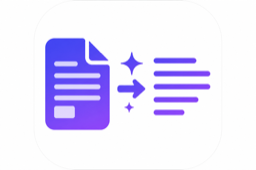

<div align="center">



# Konvertio

### Turn long documents into clean, AI-ready text.

[](LICENSE)
[](https://www.python.org/)
[](https://fastapi.tiangolo.com/)
[](CONTRIBUTING.md)

**[Try the live app](https://konvertio-812098809765.asia-south1.run.app)** · [Report a bug](https://github.com/proksy-ai/konvertio/issues) · [Request a feature](https://github.com/proksy-ai/konvertio/issues)

</div>

---

## The problem

More and more people who are **not developers**, students, researchers, and finance
professionals, use ChatGPT, Claude, and other AI tools to make sense of long documents:

- A student feeding a **textbook chapter** or an entire **book** to an AI to study and revise.
- A law student or analyst working through a long **case file**.
- A finance professional analyzing an **annual report**, filing, or earnings deck.
- A researcher summarizing **papers**, or anyone asking questions about a long story or PDF.

But these documents are a poor fit for AI tools:

- They are **long**, and often blow past the AI's context window.
- They are full of **images, charts, and logos** that get embedded as data and eat
  up the limited space, even though the analysis is almost always about the **text**.
- Converting them by hand is tedious, and most non-technical users have no easy way
  to do it.

## The solution

**Konvertio** is a free, open-source tool that converts long documents (PDF, Word,
Excel, PowerPoint, HTML, and more) into clean, **text-first Markdown**. It strips out
images and base64 data so the result drops straight into any AI tool and fits inside
its context and embedding limits.

No coding required: a non-technical user just opens the web app, drops in a file, and
copies the clean text.

Free to use, hosted with fair-use rate limits so it stays available for everyone.

## Features

- **Drag-and-drop web app** — upload a file, get clean text back, copy or download. No setup.
- **Image and clutter removal** — on by default, with an option to keep image captions.
- **Token count and savings** — see how big the result is and how much space you saved.
- **Privacy-first** — files are converted in memory and are **never written to disk or logged**.
- **Built-in rate limiting** — protects the public deployment from abuse and runaway scripts.
- **AI connectors** — use it inside Claude (via MCP) or ChatGPT (via a custom GPT Action). See [`connectors/`](connectors/README.md).
- **Deploy anywhere** — one container; ships to Google Cloud Run, Render, Docker, or your laptop.

### Supported file types

PDF · Word (`.docx`, `.doc`) · PowerPoint (`.pptx`, `.ppt`) · Excel (`.xlsx`, `.xls`) ·
CSV / TSV · HTML · JSON · XML · plain text / Markdown · EPUB · ZIP · Outlook `.msg` · and more.

## Quick start (for users)

Just open the live app and start converting, no installation needed:

**https://konvertio-812098809765.asia-south1.run.app**

1. Drag a file in (or click to choose one).
2. Keep **"Remove images to save space"** on (recommended).
3. Click **Convert document**.
4. **Copy** the clean text, or **Download** it, and paste it into ChatGPT / Claude.

## Run it yourself

### With Docker (recommended)

```bash
git clone https://github.com/proksy-ai/konvertio.git
cd konvertio
docker compose up -d
```

Open <http://localhost:8000>.

### With Python (3.10+)

Using [uv](https://github.com/astral-sh/uv):

```bash
uv venv --python=3.12 .venv
uv pip install -r requirements.txt
.venv/bin/uvicorn app.main:app --host 0.0.0.0 --port 8000
```

Or with plain `pip`:

```bash
python3 -m venv .venv && source .venv/bin/activate
pip install -r requirements.txt
uvicorn app.main:app --host 0.0.0.0 --port 8000
```

## Deploy to the cloud

- **Google Cloud Run** (recommended, scales to zero): see [`deploy/google-cloud/README.md`](deploy/google-cloud/README.md). One command:
  ```bash
  PROJECT_ID=your-project ./deploy/google-cloud/deploy.sh
  ```
- **Render** one-click: the included [`render.yaml`](render.yaml) blueprint.

## Configuration

All settings are environment variables:

| Variable | Default | Description |
|----------|---------|-------------|
| `KONVERTIO_MAX_UPLOAD_MB` | `25` | Max upload size in MB. On HTTP/1 hosts the body cap is ~32 MiB; the container serves HTTP/2 so larger files (e.g. 100 MB) work on Cloud Run with `--use-http2`. |
| `KONVERTIO_ALLOW_URL_FETCH` | `true` | Allow converting documents by link. Turn **off** on public hosts for safety. |
| `KONVERTIO_RATE_LIMIT_ENABLED` | `true` | Enable per-IP rate limiting. |
| `KONVERTIO_RATE_LIMIT_CONVERT` | `10/minute;200/day` | Limit on the conversion endpoints (per IP). |
| `KONVERTIO_RATE_LIMIT_DEFAULT` | `60/minute;1000/day` | Global limit on all requests (per IP). |
| `KONVERTIO_GA_MEASUREMENT_ID` | _(empty)_ | Optional Google Analytics 4 ID (e.g. `G-XXXXXXXXXX`). When set, the UI loads the GA4 tag. |
| `KONVERTIO_MCP_ENABLED` | `false` | Expose the MCP connector at `/mcp-server` (keep off on public hosts). |
| `PORT` | `8000` | Port to listen on (Cloud Run sets this automatically). |

## Rate limits

The public deployment is rate-limited **per IP address** to keep the service available
for everyone and protect it from abuse:

- **Conversions:** 10 per minute, 200 per day.
- **All requests:** 60 per minute, 1000 per day.

Exceeding a limit returns HTTP `429` with a friendly message. If you need higher
limits, [run your own instance](#run-it-yourself) and adjust the values above. For
strict global limits across multiple instances, back the limiter with Redis (see
[`app/ratelimit.py`](app/ratelimit.py)).

## Analytics

- **Visitors (GA4):** set `KONVERTIO_GA_MEASUREMENT_ID` and redeploy. Step-by-step
  setup is in [`deploy/google-cloud/analytics.md`](deploy/google-cloud/analytics.md).
- **Usage on Google Cloud:** Cloud Run **Metrics** (requests, latency) and
  **Logs Explorer** (`conversion_ok` lines) — same guide.

## API

Interactive docs are available at `/docs` on any running instance.

| Endpoint | Description |
|----------|-------------|
| `POST /convert` | Convert an uploaded file (multipart form). |
| `POST /convert/url` | Convert a document by URL (JSON). Used by AI connectors. |
| `GET /health` | Health check. |

```bash
curl -F "file=@report.pdf" -F "strip_images=true" \
  https://konvertio-812098809765.asia-south1.run.app/convert
```

## Architecture

```
app/
  core.py        # Conversion engine + image/data-URI stripping + stats
  main.py        # FastAPI app: REST API, static UI, mounted MCP connector
  ratelimit.py   # Per-IP rate limiting (slowapi)
  mcp_server.py  # MCP tool: convert_to_markdown (for Claude and other MCP clients)
  config.py      # Environment-based configuration
  static/        # Single-page web UI (HTML + Tailwind + vanilla JS)
connectors/      # Claude (MCP) and ChatGPT (GPT Action) setup
deploy/          # Google Cloud Run deployment
tests/           # pytest suite (core, API, security, rate limiting)
```

## Running the tests

```bash
uv pip install -r requirements-dev.txt
pytest
```

The suite covers the conversion core and image stripper, the HTTP API, error
handling, security headers, upload-size limits, and rate limiting.

## Contributing

Contributions are very welcome. Please read [CONTRIBUTING.md](CONTRIBUTING.md) for how to
set up your environment, our coding conventions, and how to open a pull request. By
participating, you agree to abide by our [Code of Conduct](CODE_OF_CONDUCT.md).

## Security

Found a vulnerability? Please **do not** open a public issue. See our
[Security Policy](SECURITY.md) for how to report it responsibly.

## License

Released under the [MIT License](LICENSE).

---

<div align="center">

Built and maintained by **[Proksy Intelligence Labs](mailto:piyush@proksy.ai)**

Questions? Reach us at [piyush@proksy.ai](mailto:piyush@proksy.ai)

</div>
